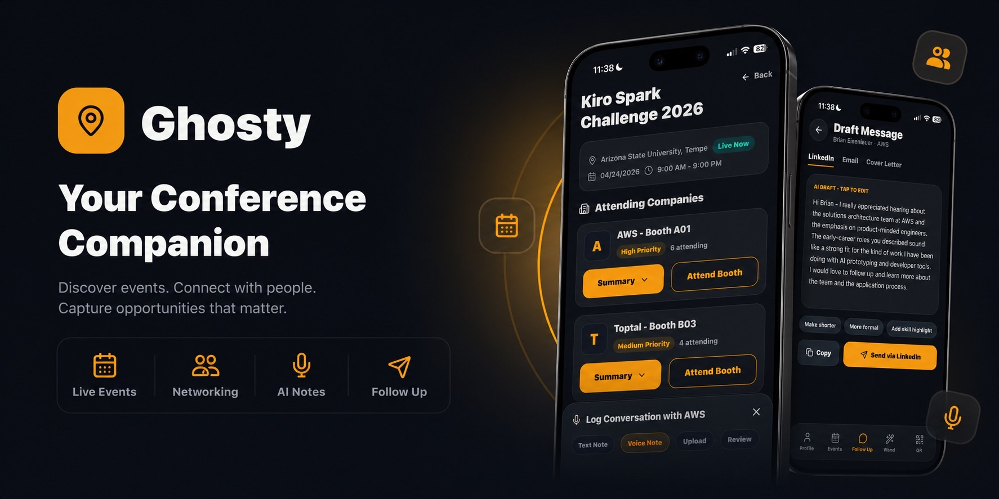
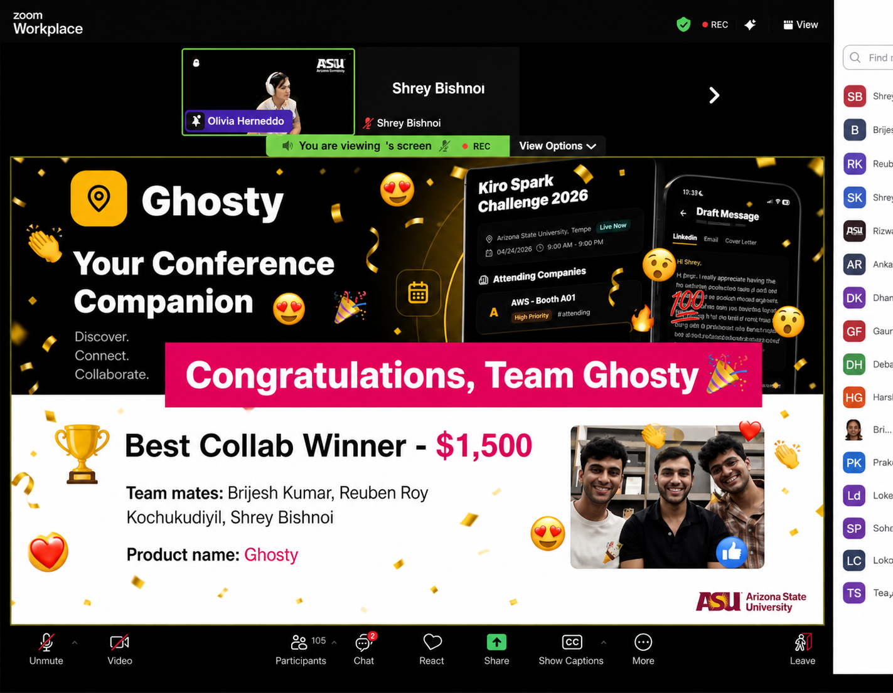
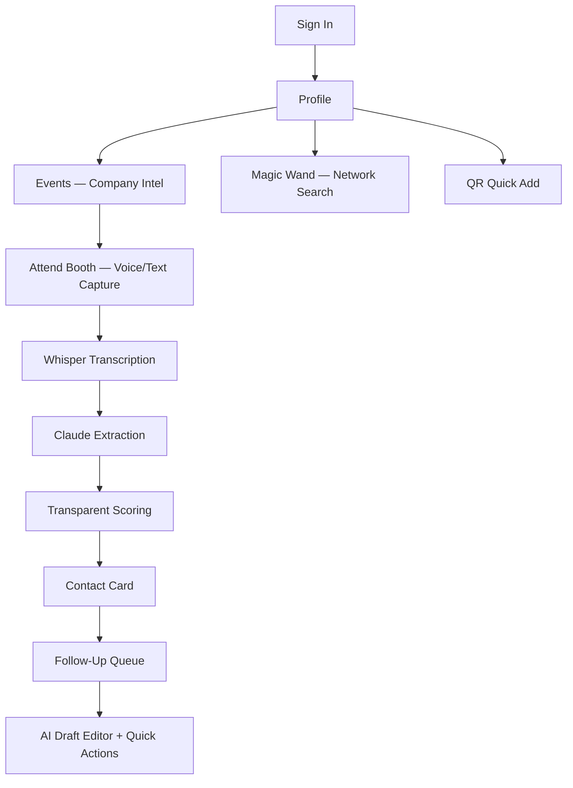

# 👻 Ghosty — Never Let a Great Conversation Ghost You



---

## 🏆 Winner — Kiro Spark Challenge 2026



**Ghosty won at the Kiro Spark Challenge 2026** at Arizona State University — a 24-hour hackathon sponsored by AWS where teams built AI-powered solutions using Kiro's spec-driven development workflow.

**Frame:** Economics — The Transparency Guardrail  
**Challenge:** Expose a hidden economic factor and turn invisible data into actionable financial insight.

---

## 🎬 Watch the Demo

[](https://youtu.be/w4Mj_PnkQ2s)

---

## The Problem

Every conference ends the same way. You meet incredible people, exchange a few words — and within 48 hours, studies suggest 80% of what made those conversations valuable is gone. The follow-up never happens. The opportunity disappears.

A single recruiter connection is often cited as being worth **$15K–$80K** in salary negotiation. A mentor relationship can shorten a career pivot by years. But nobody tracks this value. Nobody sees it. **84% of conference connections are never followed up on** (HBR).

## The Solution

Ghosty is a **voice-first mobile conference companion** that captures the context behind every human connection before it disappears — and turns social capital into a transparent, actionable career asset.

Tap the mic after a conversation. Speak for 15 seconds. Get a structured contact card with a **transparent Connection Value Score** showing an estimated dollar value of that relationship, with the full scoring breakdown visible. Draft a personalized follow-up that references your actual conversation — not a generic template.

---

## ✨ Features

### 📋 Profile & Identity
- Editable profile with bio, skills, resumes, and QR code for instant identity exchange.

### 🗓️ Event Battle Plan
- Pre-event intelligence: attending companies, booth numbers, recruiter names, hiring signals.
- Personalized pitch hints for each company based on your skills and career goals.

### 🎙️ Voice Capture → AI Extraction
- One-tap recording with real microphone via `expo-av`.
- OpenAI Whisper transcription → Claude extraction using a custom prompt and output schema built for this app (see [`.kiro/steering/extraction-prompt.md`](.kiro/steering/extraction-prompt.md)).
- Generates contact cards with name, role, company, intent tag, key details, and follow-up date.

### 📊 Transparent Connection Value Score
- Score from 1–10 with full visible breakdown: role seniority, company tier, career relevance, intent type, recency — a custom, deterministic rule-based formula (see [`src/services/scoring.ts`](src/services/scoring.ts)), not a machine-learning model.
- Salary band estimate with source label.
- Recency factor decays 10% per week without follow-up (floors at 0.25) — urgency is built into the score.

### ✍️ AI-Powered Follow-Up Drafts
- Personalized LinkedIn messages, emails, and cover letters referencing your actual conversation.
- AI quick actions: "Make shorter", "More formal", "Add skill highlight" — Claude rewrites in real time.

### 🪄 Magic Wand — Network Intelligence
- Job Search: find contacts by role or company.
- Referral Assist: one-tap prompts like "Who can introduce me to a hiring manager?"

### 📱 QR Quick Add
- Flash your Ghosty code for instant identity exchange at events.

---

## 🚀 Run Locally

```bash
npm install
npx expo start --tunnel
```

Scan the QR code with **Expo Go** on your phone.

### Optional API Keys

The app runs fully in demo mode without any keys. To enable real AI:

```bash
EXPO_PUBLIC_OPENAI_API_KEY=sk-...        # Whisper transcription
EXPO_PUBLIC_ANTHROPIC_API_KEY=sk-ant-... # Claude extraction & drafting
```

---

## 🏗️ Architecture



## 📁 Project Structure

```text
.kiro/                 Specs, hooks, and steering docs
src/components/        Voice, contact card, follow-up, dashboard UI
src/hooks/             Recorder (expo-av), queue, alert state
src/screens/           SignIn, Profile, Events, FollowUp, Wand, QR, ContactDetail
src/services/          Whisper, Claude, scoring, calendar stub, Supabase stub, network search & event logic
src/data/              Sample contacts (real mentors), events, profile
supabase/              Postgres schema (RLS) and edge function — not wired into the app at runtime (app currently persists in memory, see src/services/supabase.ts)
```

---

## 🛠️ Built With

| Layer | Technology |
|---|---|
| Frontend | React Native + Expo |
| Voice Capture | expo-av |
| Transcription | OpenAI Whisper API |
| AI Extraction & Drafting | Claude (Anthropic) |
| Scoring | Custom transparent algorithm |
| Backend Schema | Supabase Postgres + RLS |
| Development | Kiro — spec-driven development |
| Language | TypeScript (strict mode) |

Whisper, Claude, Supabase, and Expo/React Native are third-party APIs and frameworks. What was built for Ghosty: the extraction prompt and schema, the Connection Value Score algorithm (including the recency decay mechanic), the follow-up drafting prompts, the network search logic, and the app's UX.

---

## 🧠 Built with Kiro

Ghosty was developed using **Kiro's spec-driven workflow**:
- **6 specs** defining requirements before code
- **3 steering docs** guiding AI extraction, scoring, and UI design
- **4 agent hooks** documenting reactive workflows
- **Vibe coding** for UI iteration and feature refinement

See [`KIRO_USAGE.md`](KIRO_USAGE.md) for the full write-up on how Kiro shaped the build.

---

## 👥 Team

Built in 24 hours at the **Kiro Spark Challenge 2026** at Arizona State University.

---

## 📄 License

MIT — see [LICENSE](LICENSE)
